<!-- Auto-generated README using AI RAG -->
<!-- Generated on: 2026-04-23T17:23:33.113Z -->

<div align="center">

# 🚀 Flask CI/CD Pipeline with Docker & GitHub Actions

[](https://github.com/yourusername/yourrepo/actions)
[](https://hub.docker.com/r/yourusername/flasktest-app)
[](https://www.python.org/)
[](https://flask.palletsprojects.com/)
[](LICENSE)
[](https://github.com/yourusername/yourrepo/pulls)

<br/>

<p align="center">
  
  
  
  
</p>

<h3>A production-ready CI/CD pipeline demonstrating automated testing, Docker containerization, and deployment using GitHub Actions</h3>

<br/>

</div>

---

## 📑 Table of Contents

- [📖 Overview](#-overview)
- [✨ Features](#-features)
- [🏗️ Architecture](#-architecture)
- [📁 Project Structure](#-project-structure)
- [🔄 CI/CD Pipeline Workflow](#-cicd-pipeline-workflow)
- [🚀 Quick Start](#-quick-start)
- [🐳 Docker Setup](#-docker-setup)
- [🧪 Testing](#-testing)
- [📊 Pipeline Stages](#-pipeline-stages)
- [🔐 Environment Secrets](#-environment-secrets)
- [📈 Monitoring & Logs](#-monitoring--logs)
- [🛠️ Troubleshooting](#-troubleshooting)
- [🤝 Contributing](#-contributing)
- [📄 License](#-license)
- [👨‍💻 Author](#-author)

---

## 📖 Overview

This project demonstrates a complete **CI/CD pipeline** for a Flask web application using **GitHub Actions** and **Docker**. The pipeline automatically builds, tests, and publishes a Docker image to Docker Hub whenever changes are pushed to the main branch.

### Key Objectives

- 🎯 **Automated Testing**: Run unit tests on every push and pull request
- 📦 **Containerization**: Package the application using Docker
- 🚀 **Continuous Deployment**: Automatically build and push Docker images
- 🔒 **Security**: Use GitHub Secrets for secure credential management

---

## ✨ Features

<div align="center">

| Feature | Description | Status |
|---------|-------------|--------|
| 🧪 **Automated Testing** | Pytest-based unit tests run automatically | ✅ |
| 🐳 **Docker Integration** | Multi-stage Docker build with caching | ✅ |
| 🔄 **CI/CD Pipeline** | Three-stage pipeline (Build → Test → Deploy) | ✅ |
| 📦 **Docker Hub Publishing** | Automatic image push to registry | ✅ |
| 🔐 **Secret Management** | Secure credential handling via GitHub Secrets | ✅ |
| 📊 **Pipeline Visualization** | Clear workflow with dependency management | ✅ |

</div>

---

## 🏗️ Architecture

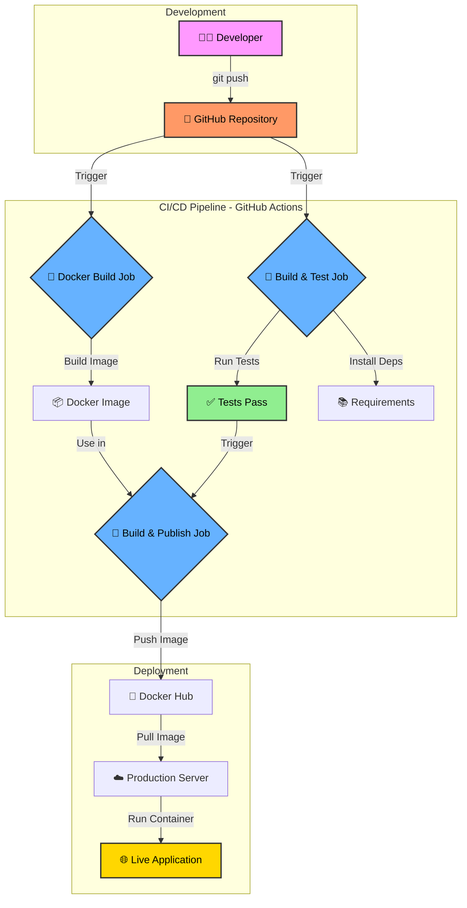

### Pipeline Flow Diagram

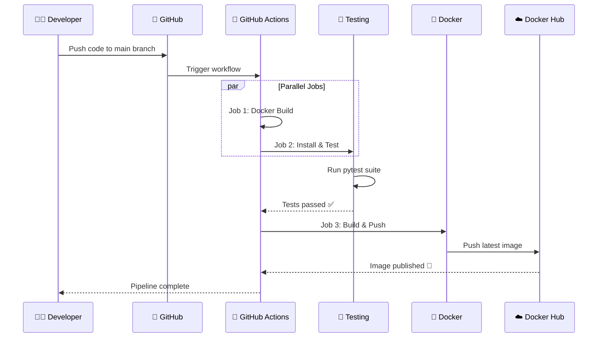

---

## 📁 Project Structure

```
📦 Github-actions-with-Docker
├── 📂 .github
│   └── 📂 workflows
│       └── 📄 Python_CI.yaml          # GitHub Actions workflow
├── 📄 app.py                          # Flask application
├── 📄 test_app.py                     # Unit tests
├── 📄 Dockerfile                      # Docker configuration
├── 📄 requirements.txt                # Python dependencies
├── 📄 .gitignore                      # Git ignore rules
└── 📄 README.md                       # Project documentation
```

### File Descriptions

<details>
<summary><b>📄 Click to expand file details</b></summary>

| File | Purpose | Tech Stack |
|------|---------|------------|
| `app.py` | Main Flask application with single endpoint | Flask 3.0 |
| `test_app.py` | Unit tests for the Flask endpoint | pytest |
| `Dockerfile` | Container definition with layer caching | Python 3.10-slim |
| `requirements.txt` | Python package dependencies | flask, pytest |
| `Python_CI.yaml` | CI/CD pipeline configuration | GitHub Actions |
| `.gitignore` | Files excluded from version control | venv |

</details>

---

## 🔄 CI/CD Pipeline Workflow

### Workflow Triggers

```yaml
on:
  push:
    branches: [ "main" ]
  pull_request:
    branches: [ "main" ]
```

### Pipeline Visualization

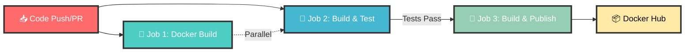

### Detailed Job Dependencies

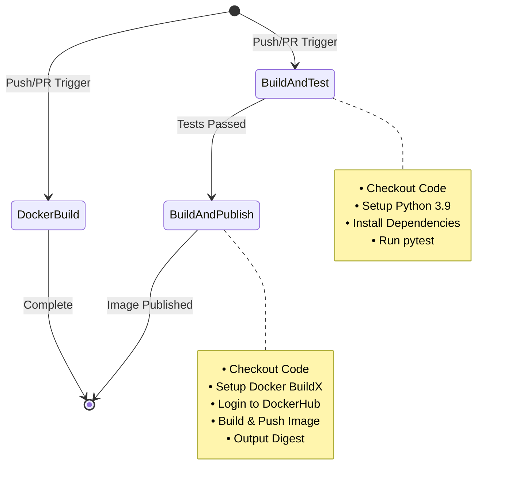

---

## 🚀 Quick Start

### Prerequisites

<div align="center">

| Tool | Version | Installation |
|------|---------|--------------|
|  | 3.9+ | [python.org](https://python.org) |
|  | 20.10+ | [docker.com](https://docker.com) |
|  | 2.30+ | [git-scm.com](https://git-scm.com) |

</div>

### Local Development Setup

#### 1. Clone the Repository

```bash
git clone https://github.com/yourusername/yourrepo.git
cd yourrepo
```

#### 2. Set Up Virtual Environment

```bash
# Create virtual environment
python -m venv venv

# Activate (Windows)
venv\Scripts\activate

# Activate (Linux/Mac)
source venv/bin/activate
```

#### 3. Install Dependencies

```bash
pip install --upgrade pip
pip install -r requirements.txt
```

#### 4. Run the Application

```bash
python app.py
```

The application will start at `http://localhost:5000`

<div align="center">


</div>

#### 5. Test the Endpoint

```bash
curl http://localhost:5000/
# Output: Hello World
```

---

## 🐳 Docker Setup

### Docker Image Structure

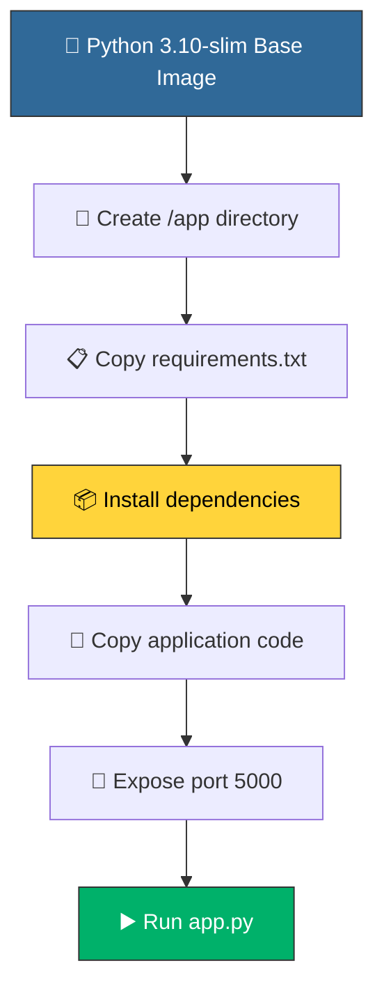

### Build Docker Image

```bash
# Build with a tag
docker build -t flasktest-app:latest .

# Build with specific tag and timestamp
docker build -t flasktest-app:$(date +%s) .
```

### Run Docker Container

```bash
# Run container in detached mode
docker run -d -p 5000:5000 --name flask-app flasktest-app:latest

# Check container status
docker ps

# View logs
docker logs flask-app

# Stop container
docker stop flask-app

# Remove container
docker rm flask-app
```

### Docker Commands Cheat Sheet

| Command | Description |
|---------|-------------|
| `docker build -t name:tag .` | Build image from Dockerfile |
| `docker run -d -p 5000:5000 name:tag` | Run container in background |
| `docker ps` | List running containers |
| `docker stop container_id` | Stop a container |
| `docker rm container_id` | Remove a container |
| `docker images` | List all images |
| `docker rmi image_id` | Remove an image |
| `docker logs container_id` | View container logs |

---

## 🧪 Testing

### Test Structure

```python
from app import app

def test_app():
    response = app.test_client().get("/")
    
    assert response.status_code == 200
    assert response.data == b"Hello World"
```

### Run Tests Locally

```bash
# Run all tests
pytest

# Run with verbose output
pytest -v

# Run with test coverage (if installed)
pytest --cov=app test_app.py
```

### Test Results Example

```
collected 1 item

test_app.py .                                                          [100%]

============================== 1 passed in 0.05s ==============================
```

---

## 📊 Pipeline Stages

### Stage 1: Docker Build (`dockerbuild`)

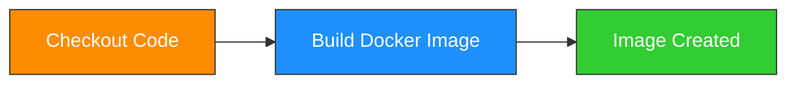

> ⚡ **Note**: This job runs in parallel with the testing job

### Stage 2: Build and Test (`build-and-test`)

```yaml
steps:
  - Checkout Code
  - Setup Python 3.9
  - Install Dependencies
  - Run Tests
```

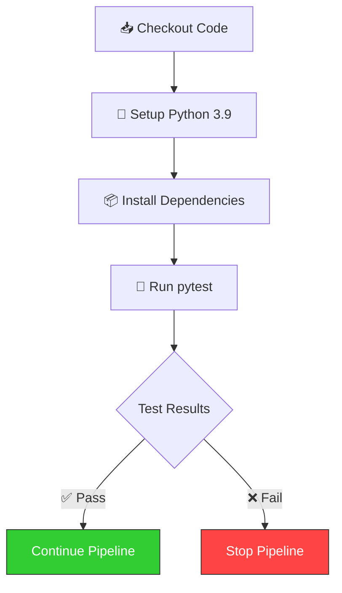

### Stage 3: Build and Publish (`build-and-publish`)

```yaml
steps:
  - Checkout Code
  - Setup Docker BuildX
  - Login to DockerHub
  - Build and Push Image
  - Output Image Digest
```

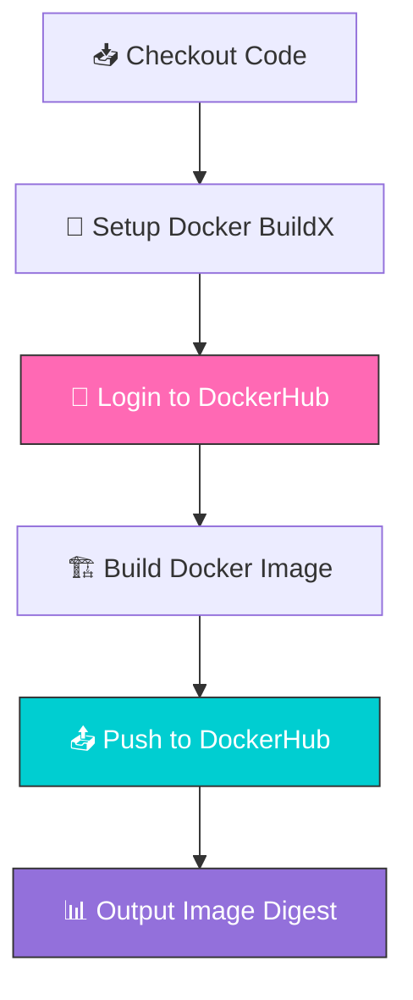

---

## 🔐 Environment Secrets

### Required GitHub Secrets

<div align="center">

| Secret Name | Description | Where to Get It |
|-------------|-------------|-----------------|
| `DOCKER_USERNAME` | Docker Hub username | [hub.docker.com](https://hub.docker.com) |
| `DOCKER_PASSWORD` | Docker Hub password/token | [hub.docker.com/settings/security](https://hub.docker.com/settings/security) |

</div>

### Setting Up Secrets

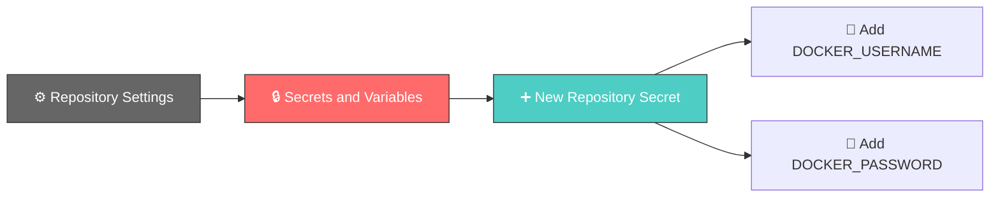

Detailed steps:

1. Go to your GitHub repository
2. Navigate to **Settings** → **Secrets and variables** → **Actions**
3. Click **New repository secret**
4. Add `DOCKER_USERNAME` with your Docker Hub username
5. Add `DOCKER_PASSWORD` with your Docker Hub access token

> ⚠️ **Security Note**: Always use Docker Hub Access Tokens instead of your account password

---

## 📈 Monitoring & Logs

### GitHub Actions Dashboard

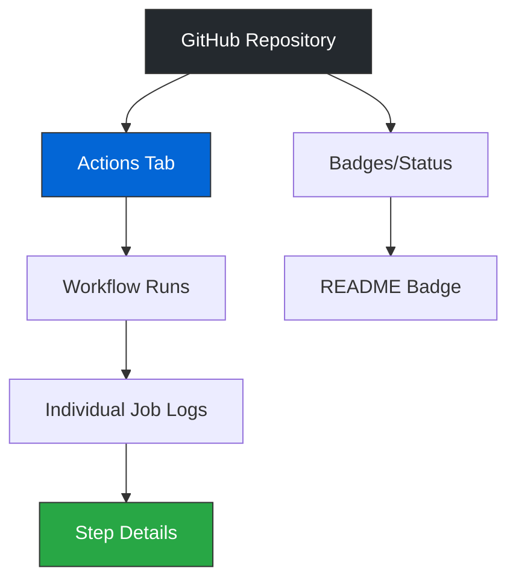

### Viewing Pipeline Status

1. **GitHub UI**: Navigate to the "Actions" tab in your repository
2. **Badge**: Check the workflow status badge in the README
3. **Notifications**: Enable email/slack notifications for workflow failures

### Docker Hub Monitoring

```bash
# Check image tags
docker pull username/flasktest-app:latest

# Inspect image
docker inspect username/flasktest-app:latest

# Check image history
docker history username/flasktest-app:latest
```

---

## 🛠️ Troubleshooting

### Common Issues and Solutions

<details>
<summary><b>🐛 Docker Build Fails</b></summary>

**Problem**: `docker build` command fails

**Solutions**:
```bash
# Check Docker daemon is running
docker version

# Clean Docker cache
docker system prune -a

# Check disk space
docker system df

# Build with no cache
docker build --no-cache -t flasktest-app .
```
</details>

<details>
<summary><b>🐛 Tests Failing in Pipeline</b></summary>

**Problem**: Tests pass locally but fail in GitHub Actions

**Solutions**:
```bash
# Check Python version compatibility
python --version

# Verify all dependencies in requirements.txt
pip freeze > current_deps.txt
diff current_deps.txt requirements.txt

# Run tests in clean environment
docker run -it --rm -v ${PWD}:/app python:3.9 bash
cd /app && pip install -r requirements.txt && pytest
```
</details>

<details>
<summary><b>🐛 Docker Push Authentication Error</b></summary>

**Problem**: `denied: requested access to the resource is denied`

**Solutions**:
```bash
# Verify secrets are set correctly
echo $DOCKER_USERNAME

# Login manually to test credentials
docker login -u $DOCKER_USERNAME

# Check Docker Hub token permissions
# Go to hub.docker.com/settings/security
```
</details>

<details>
<summary><b>🐛 Port Already in Use</b></summary>

**Problem**: `Error: port is already allocated`

**Solutions**:
```bash
# Find process using port 5000
# Windows
netstat -ano | findstr :5000

# Linux/Mac
lsof -i :5000

# Kill the process
# Windows
taskkill /PID <PID> /F

# Linux/Mac
kill -9 <PID>

# Or use different port
docker run -d -p 5001:5000 flasktest-app
```
</details>

---

## 🤝 Contributing

We welcome contributions! Here's how you can help:

### Contribution Workflow

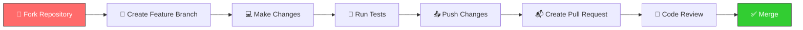

### Steps to Contribute

1. **Fork** the repository
2. **Clone** your fork:
   ```bash
   git clone https://github.com/yourusername/repo.git
   ```
3. **Create a branch**:
   ```bash
   git checkout -b feature/amazing-feature
   ```
4. **Make changes** and commit:
   ```bash
   git add .
   git commit -m "✨ Add amazing feature"
   ```
5. **Push** to your fork:
   ```bash
   git push origin feature/amazing-feature
   ```
6. **Open a Pull Request** on GitHub

### Commit Message Convention

| Prefix | Description |
|--------|-------------|
| ✨ `feat:` | New feature |
| 🐛 `fix:` | Bug fix |
| 📚 `docs:` | Documentation |
| 🎨 `style:` | Formatting |
| ♻️ `refactor:` | Code restructuring |
| 🧪 `test:` | Adding tests |
| 🔧 `chore:` | Maintenance |

---

## 📄 License

<div align="center">

[](https://opensource.org/licenses/MIT)

This project is licensed under the MIT License - see the [LICENSE](LICENSE) file for details.

</div>

---

## 👨‍💻 Author

<div align="center">

**Your Name**

[](https://github.com/yourusername)
[](https://linkedin.com/in/yourprofile)
[](https://twitter.com/yourhandle)
[](https://hub.docker.com/u/yourusername)

</div>

---

## 🙏 Acknowledgments

- [Flask Documentation](https://flask.palletsprojects.com/)
- [Docker Documentation](https://docs.docker.com/)
- [GitHub Actions Documentation](https://docs.github.com/en/actions)
- [pytest Documentation](https://docs.pytest.org/)

---

## ⭐ Support

If you found this project helpful, please give it a ⭐️!

<div align="center">

[](https://star-history.com/#yourusername/yourrepo&Date)

<br/>

### 🚀 Made with ❤️ for the DevOps Community

</div>

---

<div align="center">

**📊 Project Statistics**


</div>
```
